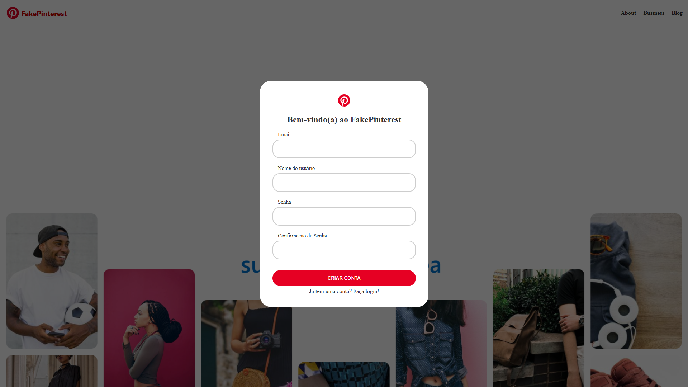
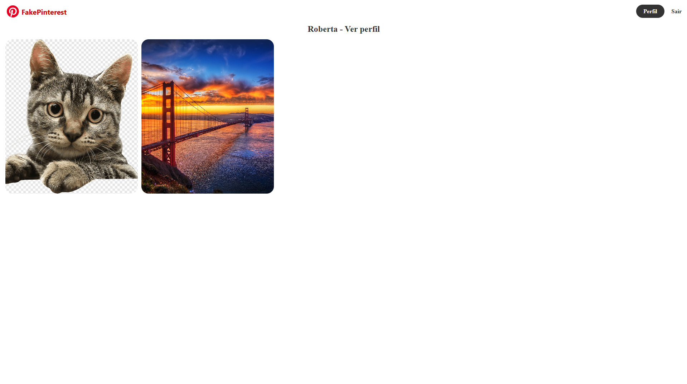

<h1 align="center">Réplica Do Pinterest - Projeto Web com Flask</h1>

  <a href="#-tecnologias">Tecnologias</a>&nbsp;&nbsp;&nbsp;|&nbsp;&nbsp;&nbsp;
  <a href="#-projeto">Projeto</a>&nbsp;&nbsp;&nbsp; | &nbsp;&nbsp;&nbsp;
  <a href="#-principais-bibliotecas">Principais Bibliotecas</a>&nbsp;&nbsp;&nbsp; | &nbsp;&nbsp;&nbsp
  <a href="#-Para-executar-o-projeto">Para executar o projeto</a>

 

  
  
  
  
  

## 🚀 Tecnologias

Esse projeto foi desenvolvido com as seguintes tecnologias:

- Python
- Flask

## 📚 Principais Bibliotecas

- bcrypt==4.2.0
- blinker==1.8.2
- click==8.1.7
- colorama==0.4.6
- dnspython==2.6.1
- email_validator==2.2.0
- Flask==3.0.3
- Flask-Bcrypt==1.0.1
- Flask-Login==0.6.3
- Flask-SQLAlchemy==3.1.1
- Flask-WTF==1.2.1
- greenlet==3.0.3
- idna==3.8
- itsdangerous==2.2.0
- Jinja2==3.1.4
- MarkupSafe==2.1.5
- python-dotenv==1.0.1
- SQLAlchemy==2.0.34
- typing_extensions==4.12.2
- Werkzeug==3.0.4
- WTForms==3.1.2

## 💻 Projeto

Desenvolvendo um réplica funcional do Pinterest utilizando o framework Flask em Python, integrando as principais bibliotecas para autenticação (Criptografia de senhas utilizando bcrypt), segurança, gerenciamento de de formulários, banco de dados e mais. A abordagem modular e a utilização de bibliotecas como Flask-WTF e Flask-SQLAlchemy facilitam a escalabilidade e a manutenção do projeto.

## 👨‍💻 Para executar o projeto

1. Clone o repositório: `git clone https://github.com/davioliveiraes/replica-pinterest-flask.git`
2. Entre na pasta do projeto: `cd replica-pinterest-flask`
3. Ative o ambiente virtual: `venv\Scripts\Activate.bat` (windows) 
4. Instale as dependências com: `pip install -r requirements.txt`
5. Execute o programa: `python main.py`
6. Abaixo vai aparecer algo parecido com Running on `http://127.0.0.1:5000` - link para acessar o site no navegador.